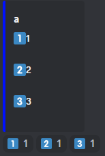
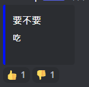
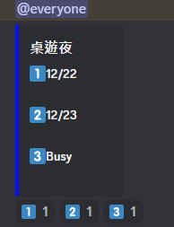

# TableTopDCbot

## 功能
- 投票
    > !t vote title option1 option2 option3...

    最多可以到option10 

    

    當option只有一個時會變成贊成與不贊成

    
- 定時詢問
    
    目前每個禮拜一會詢問當周桌遊夜時間

    
    
    並且可以透過
    > !t getResult

    > !t gr
    取得投票結果